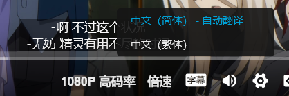

# Bilibili Subtitle Tweaks

增强 Bilibili 番剧的 CC 字幕，包含自动翻译及自动断行功能。

### 用法

1. 安装 userscript (需要 Tampermonkey 等浏览器插件)

   [Install](https://github.com/Kr328/bilibili-subtitle-tweaks/releases/latest/download/bilibili-redirect.user.js)

2. 确认是否生效

   

### 构建

1. 安装依赖
   ```bash
   pnpm install
   ```

2. 构建
   ```bash
   pnpm run build
   ```

3. 获取文件 `dist/bilibili-subtitle-tweaks.user.js`